Boston 311 AI System
Project Overview

The Boston 311 AI System is a scalable data pipeline and AI-driven analytics system designed to process and understand Boston’s non-emergency service request data.
It automates the ingestion, cleaning, transformation, and deployment of city service data to support public dashboards and an LLM-powered chatbot that helps citizens get real-time updates and insights.

🚀 Tech Stack

Data Source: Boston 311 API
Pipeline Orchestration: Apache Airflow (Google Cloud Composer)
Data Warehouse: Google BigQuery
Storage: Google Cloud Storage (GCS)
Machine Learning: Vertex AI / PyTorch
Backend: FastAPI (deployed on Cloud Run)
Frontend: Next.js + Mapbox
Infrastructure: Terraform (GCP)
## 🧩 System Architecture

```mermaid
flowchart TD
    T0["☁️ Google Cloud Composer / Airflow"]:::title

    subgraph Composer[" "]
        D1["boston311_daily – Incremental Ingestion (Last 28 days)"] --> GCS["🗂️ Google Cloud Storage"]
        D2["boston311_weekly – Full Refresh + Deduplication"] --> GCS
        D3["boston311_build_filtered_tables – Chatbot & Dashboard Views"] --> BQ2["📊 BigQuery Production Tables"]
        D4["airflow_monitoring – Liveness Probe"]
    end

    GCS --> BQ1["🧾 BigQuery Staging"]
    BQ1 --> BQ2
    BQ2 --> API["⚙️ FastAPI – Chatbot & APIs"]
    API --> WEB["🗺️ Next.js + Mapbox – Visualization"]

    %% Connect Title to Subgraph
    T0 --> D1

    %% Styling
    classDef title fill:#ffffff,stroke:none,font-weight:bold,font-size:18px,color:#000,text-align:center;
    style Composer fill:#fefefe,stroke:#333,stroke-width:1px
    style GCS fill:#f7dc6f,stroke:#333,stroke-width:1px,color:#000
    style BQ1 fill:#aed6f1,stroke:#333,stroke-width:1px,color:#000
    style BQ2 fill:#5499c7,stroke:#222,stroke-width:1px,color:#fff
    style API fill:#82e0aa,stroke:#222,stroke-width:1px,color:#000
    style WEB fill:#f5b7b1,stroke:#222,stroke-width:1px,color:#000
    style D1 fill:#2c3e50,stroke:#555,stroke-width:1px,color:#fff
    style D2 fill:#2c3e50,stroke:#555,stroke-width:1px,color:#fff
    style D3 fill:#34495e,stroke:#555,stroke-width:1px,color:#fff
    style D4 fill:#1f618d,stroke:#555,stroke-width:1px,color:#fff
```

⚡ Installation
Prerequisites

Python 3.9+

Node.js 18+

Docker

Terraform 1.5+

Google Cloud SDK (gcloud)

Setup Instructions
# 1️⃣ Clone the repository
git clone https://github.com/sharonjennifer/boston-311-ai-system.git
cd boston-311-ai-system

# 2️⃣ Create and activate a virtual environment
python -m venv venv
source venv/bin/activate  # macOS/Linux
# or
venv\Scripts\activate     # Windows

# 3️⃣ Install dependencies
pip install -r requirements.txt

# 4️⃣ Set up environment variables
cp .env.example .env
# Edit .env with your GCP credentials and project-specific variables

Authenticate with Google Cloud
gcloud auth application-default login
gcloud config set project boston311-mlops

⚙️ Data Pipeline Orchestration (Airflow / Composer)

All workflows are managed by Google Cloud Composer, which runs Airflow to automate ETL, monitor runs, and handle failure recovery.

The DAGs are stored in the Composer environment’s DAGs folder (gs://boston311-composer/dags/) and execute according to their defined schedules.

🗓️ Active Pipelines
Pipeline	Description	Schedule	Core Logic
boston311_daily	Incrementally ingests new and updated 311 service requests for the past 28 days.	@daily	Fetches recent records, stores in GCS, loads into BigQuery staging, and merges into production.
boston311_weekly	Performs a full rebuild and deduplication of all service request data.	0 4 * * 1 (Mondays)	Uses ROW_NUMBER() and CREATE OR REPLACE to ensure clean full refresh.
boston311_build_filtered_tables	Rebuilds chatbot-specific and dashboard-friendly BigQuery tables.	0 1 * * * (Daily at 1 AM)	Executes transformation SQL to create chatbot and dashboard tables for LLM and analytics.
airflow_monitoring	Liveness DAG to ensure Composer is healthy and operational.	*/10 * * * *	Runs a Bash echo probe every 10 minutes for monitoring.
🧠 How Each Pipeline Works
🟢 boston311_daily

Saves data as newline-delimited JSON in GCS.

Loads into a staging BigQuery table.

Merges into the production table using MERGE SQL.

Includes retry, error logging, and empty-file skip logic.

🔵 boston311_weekly

Fetches the entire dataset weekly for consistency.

Deduplicates via ROW_NUMBER() partitioning.

Fully overwrites the target table.

Used for long-term corrections or schema alignment.

🟣 boston311_build_filtered_tables

Runs daily to rebuild lightweight analytical tables for:

Chatbot: Contains filtered fields (case_enquiry_id, type, reason, etc.) for faster text queries.

Dashboard: Aggregates records by neighborhood, department, and type with case_count and on_time_count.

Output tables:

boston311.chatbot

boston311.dashboard

Optimized for real-time queries and model serving.

🟠 airflow_monitoring

Ensures the Composer scheduler remains active.

Uses a simple echo test command.

Runs every 10 minutes and retries once on failure.

Sends alert notifications to Composer monitoring UI.

🔍 Tracking, Logging & Error Handling

Structured logging: Each DAG logs pages, record counts, and ranges.

Centralized monitoring: Logs are pushed to Google Cloud Logging.

Error alerts: Composer sends email/SMS on task failure.

Short-circuit logic: Skips empty tasks automatically.

Data auditability: All JSONL files archived in gs://boston311-bucket/boston311/raw/YYYY-MM-DD/.

⚙️ Pipeline Performance Optimization

Incremental daily ingestion keeps API usage efficient.

Weekly rebuilds ensure long-term consistency.

Filtered tables minimize query latency for dashboards and LLM inference.

Airflow Gantt charts used to monitor performance bottlenecks.

Average runtimes:

Daily DAG ≈ 5 minutes

Weekly DAG ≈ 15 minutes

Filtered tables DAG ≈ 2 minutes

🧱 Repository Structure
boston-311-ai-system/
├── dags/
│   ├── boston311_daily.py
│   ├── boston311_weekly.py
│   ├── boston311_build_filtered_tables.py
│   └── airflow_monitoring.py
├── models/              # ML and LLM logic
├── services/            # FastAPI backend
├── webapp/              # Next.js + Mapbox frontend
├── infra/               # Terraform scripts
└── docs/                # Documentation

☁️ Deployment
Deploy Infrastructure
cd infra/terraform
terraform init
terraform apply

Deploy DAGs

Upload to Composer bucket:

gsutil cp dags/*.py gs://boston311-composer/dags/

Deploy API
gcloud builds submit --tag gcr.io/boston311-mlops/api-service
gcloud run deploy api-service --image gcr.io/boston311-mlops/api-service

📈 Monitoring
Tool	Purpose
Airflow UI – DAG Graph	Visualize pipeline dependencies
Airflow Gantt View	Analyze execution times
Cloud Logging	Centralized task logs
Cloud Monitoring	Alerting for failures
BigQuery Console	Verify data refreshes
📄 License

MIT License — see LICENSE
